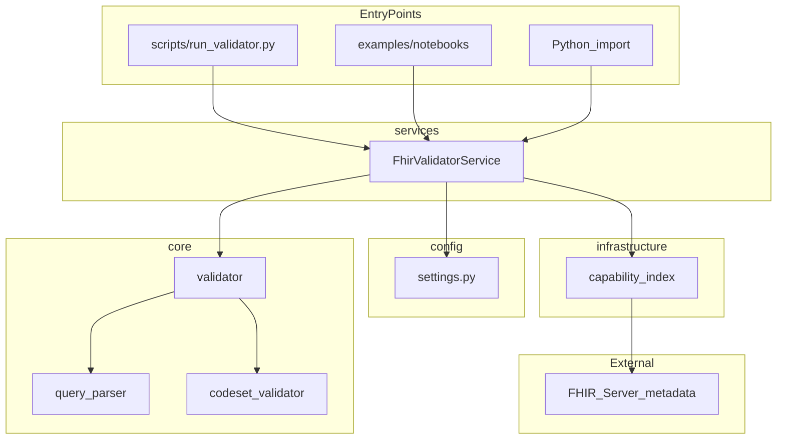

# FHIR Search Validator

A pre-flight validator for FHIR REST search queries. Given a URL like `Patient?gender=male`, it checks syntax and semantics against a FHIR server's declared capabilities **before** you send the request.

## Why use this?

FHIR servers expose what they support via a **CapabilityStatement** (fetched from `/metadata`). Search parameters, modifiers, and comparators vary by server. This tool validates a query URL against that metadata so you catch unsupported resource types, unknown search params, invalid modifiers, and bad values early.

## How it works



1. **Parse** the query URL into resource type and query parameters
2. **Load** the server's CapabilityStatement from `/metadata`
3. **Validate** against allowed resource types, search params, modifiers, and comparators
4. **Apply extra rules** for known value sets and Patient identifiers

## What it validates

| Check | Description | Example error |
|-------|-------------|---------------|
| Resource type | Must be supported by the server | `Resource type 'Foo' is not supported.` |
| Search parameters | Must exist for that resource type | `Search param 'foo' not allowed for resource` |
| Modifiers / comparators | e.g. `:exact`, `:gt` must be allowed for that param | `Modifier/comparator 'missing' not allowed for param 'gender'` |
| Static value sets | Known coded values for specific params | `Value 'fe' for 'Patient.gender' is not allowed.` |
| Patient identifiers | Numeric, 8–10 digits, not all identical | `Patient.identifier '11111111' invalid: Identifier cannot be all identical digits.` |

### Supported value sets (built-in)

- `Patient.gender` — `male`, `female`, `other`, `unknown`
- `AllergyIntolerance.verification-status` — `unconfirmed`, `confirmed`, `refuted`, `entered-in-error`
- `AllergyIntolerance.clinical-status` — `active`, `inactive`, `resolved`

## Supported servers

Built-in **public test servers** require **no authentication** — suitable for local dev, integration tests, and manual validation. Registry informed by the [HL7 Public Test Servers](https://confluence.hl7.org/display/FHIR/Public+Test+Servers) list.

Select via `FHIR_DEFAULT_SERVER_KEY` in `config/.env.local`:

| Key | Server | Base URL | Auth |
|-----|--------|----------|------|
| `hapi` (default) | HAPI FHIR Reference Server (R4) | `https://hapi.fhir.org/baseR4` | None |
| `firely` | Firely Public Server (R4) | `https://server.fire.ly` | None |
| `spark` | Spark FHIR Reference Server (R4) | `https://spark.incendi.no/fhir` | None |
| `wildfhir` | AEGIS WildFHIR Community (R4) | `https://wildfhir.wildfhir.org/r4` | None |

Full details: [docs/public-test-servers.md](docs/public-test-servers.md)

```bash
# Use Firely instead of HAPI
export FHIR_DEFAULT_SERVER_KEY=firely
fhir-validate "https://server.fire.ly/Patient?gender=male"

# Test all public servers
python3 scripts/run_all_tests.py
```

Override with `FHIR_METADATA_URL` and `FHIR_SERVER_BASE` for custom (possibly authenticated) servers.

## Project structure

```text
fhir_query_validator-DS-fhir/
├── config/
│   └── .env.example          # Environment variable template
├── docs/
│   └── adr/                  # Architectural decision records
├── examples/
│   └── notebooks/            # Demo Jupyter notebook
├── planning/                 # Sprint notes and roadmap
├── scripts/
│   ├── run_validator.py      # CLI entry point
│   └── run_all_tests.py      # Multi-server integration script
├── src/
│   └── fhir_validator_agent/
│       ├── config/           # Environment and server settings
│       ├── core/             # Parsing and validation rules
│       ├── infrastructure/   # HTTP calls (CapabilityStatement, OAuth)
│       └── services/         # Application orchestration
└── tests/
    ├── unit/                 # Fast, offline unit tests
    ├── regression/           # JSON-driven regression cases
    └── integration/          # Live FHIR server tests (optional)
```

## Quick Start

Get validating in under two minutes. No configuration required — defaults target the public HAPI FHIR R4 server.

### Prerequisites

- **Python 3.11+**
- `pip` and a virtual environment (recommended)

### Step 1 — Clone and install

```bash
git clone <repo-url>
cd fhir_query_validator

python3 -m venv .venv
source .venv/bin/activate        # Windows: .venv\Scripts\activate

pip install -e ".[dev,notebook]"
```

### Step 2 — Validate your first query

```bash
fhir-validate "https://hapi.fhir.org/baseR4/Patient?gender=male"
```

Expected output:

```text
Valid: True
```

Try an invalid query to see structured errors:

```bash
fhir-validate "https://hapi.fhir.org/baseR4/Patient?gender=fe"
```

```text
Valid: False
Errors:
 - Value 'fe' for 'Patient.gender' is not allowed. Allowed values: {'male', 'female', 'other', 'unknown'}
```

### Step 3 — Use from Python

```python
from fhir_validator_agent import FhirValidatorService

service = FhirValidatorService.from_env()
result = service.validate_query("https://hapi.fhir.org/baseR4/Patient?gender=male")

print(result)
# {"valid": True, "errors": []}
```

> `FhirValidatorAgent` is a backward-compatible alias for `FhirValidatorService`.

### Step 4 — Configure a different server (optional)

Defaults use HAPI R4. To switch servers or enable OAuth:

```bash
cp config/.env.example config/.env.local
```

Edit `config/.env.local` — for example, to use Spark (no auth):

```env
FHIR_DEFAULT_SERVER_KEY=spark
FHIR_USE_AUTH=false
```

See [Configuration](#configuration) for all variables.

### Other entry points

| Entry point | Command |
|-------------|---------|
| CLI (installed) | `fhir-validate "<url>"` |
| Script wrapper | `python3 scripts/run_validator.py "<url>"` |
| Demo notebook | `jupyter notebook examples/notebooks/FHIR_search_validator_demo.ipynb` |
| Multi-server script | `python3 scripts/run_all_tests.py` |

---

## How to Run Tests

The test suite uses **pytest**. All offline tests (unit + regression) run without network access and are suitable for CI.

### Prerequisites

Install dev dependencies (included if you followed Quick Start):

```bash
pip install -e ".[dev]"
```

### Recommended commands

| What you want | Command | Network required? |
|---------------|---------|-------------------|
| Run all offline tests | `pytest -m "not integration"` | No |
| Unit tests only | `make test-unit` | No |
| Regression suite only | `make test-regression` | No |
| Coverage report (80% gate) | `make test-cov` | No |
| Integration tests (live servers) | `make test-integration` | Yes |
| Everything | `pytest` | Partial |

### Examples

**All offline tests** (recommended before every commit):

```bash
pytest -m "not integration" -v
```

**Unit tests** — parser, validator, config, CLI, service (mocked):

```bash
make test-unit
# equivalent: pytest tests/unit -v
```

**Regression tests** — fixed scenarios in `tests/regression/cases.json` that guard known good/bad behavior:

```bash
make test-regression
# equivalent: pytest tests/regression -m regression -v
```

**Coverage** — reports coverage on `core/` and `services/` with an 80% minimum:

```bash
make test-cov
# equivalent: pytest -m "not integration" --cov=fhir_validator_agent --cov-report=term-missing
```

**Integration tests** — hits live HAPI FHIR server (skippable if offline):

```bash
make test-integration
# equivalent: pytest tests/integration -m integration -v
```

**Multi-server manual script** — HAPI and Firely positive/negative scenarios:

```bash
python3 scripts/run_all_tests.py
```

### Test layout

```text
tests/
├── conftest.py              # Shared fixtures (CapabilityStatement, validator)
├── unit/                    # Isolated unit tests per module
├── regression/
│   ├── cases.json           # Fixed regression scenarios
│   └── test_regression.py   # Parametrized regression runner
└── integration/             # Live FHIR server tests
```

| Directory | Purpose | Speed |
|-----------|---------|-------|
| `tests/unit/` | Module-level tests (parser, validator, settings, CLI) | Fast |
| `tests/regression/` | JSON-driven cases — prevents validation regressions | Fast |
| `tests/integration/` | End-to-end against public FHIR servers | Slow (network) |

### Adding a regression case

Append an entry to `tests/regression/cases.json`:

```json
{
  "id": "patient_gender_unknown_value",
  "description": "Reject unknown gender coded value",
  "query": "https://hapi.fhir.org/baseR4/Patient?gender=fe",
  "expected_valid": false,
  "expected_error_substrings": ["Patient.gender", "fe"]
}
```

Then run:

```bash
make test-regression
```

### Pytest markers

| Marker | Meaning |
|--------|---------|
| `integration` | Calls a live FHIR server |
| `regression` | Fixed case from `cases.json` |

Exclude integration tests: `pytest -m "not integration"`

Run only regression: `pytest -m regression`

## Configuration

| Variable | Default | Description |
|----------|---------|-------------|
| `FHIR_DEFAULT_SERVER_KEY` | `hapi` | Preset key: `hapi`, `firely`, `spark`, `wildfhir` |
| `FHIR_METADATA_URL` | (from preset) | Override CapabilityStatement URL |
| `FHIR_SERVER_BASE` | (from preset) | Override FHIR server base URL |
| `FHIR_USE_AUTH` | `false` | Enable OAuth client-credentials flow |
| `TOKEN_URL` | — | OAuth token endpoint |
| `CLIENT_ID` | — | OAuth client ID |
| `CLIENT_SECRET` | — | OAuth client secret |

Copy `config/.env.example` to `config/.env.local` and edit. Never commit `.env.local` — it is gitignored.

## Development

### Adding a new static value set

Edit `src/fhir_validator_agent/core/codeset_validator.py` and add an entry to `STATIC_VALUESETS`:

```python
STATIC_VALUESETS = {
    "Patient.gender": {"male", "female", "other", "unknown"},
    # Add new entries as "ResourceType.param_name": {allowed, values}
}
```

### Running integration tests against multiple servers

```bash
python scripts/run_all_tests.py
```

## Documentation

| Doc | Description |
|-----|-------------|
| [Specification (SDD)](docs/Spec/README.md) | Authoritative implementation spec for agents and developers |
| [PRD](docs/prd.md) | Problem statement, approach, in/out of scope |
| [ADR 001](docs/adr/001-fhir-search-validator.md) | Architecture and design decisions |
| [Configuration](docs/configuration.md) | Environment variables and troubleshooting |
| [Development](docs/development.md) | Local setup, project layout, adding tests |
| [API Reference](docs/api.md) | `FhirValidatorService`, CLI, registry |
| [Public Test Servers](docs/public-test-servers.md) | No-auth FHIR sandboxes for testing |
| [Sample Output](docs/sample-output.md) | Captured CLI, API, and test results |
| [E2E Checklist](docs/e2e-checklist.md) | Release sign-off checklist |
| [CONTRIBUTING](CONTRIBUTING.md) | How to contribute |
| [CHANGELOG](CHANGELOG.md) | Release history |
| [Utility Guide (Word)](docs/Utility-FHIR%20Query%20Validator.docx) | Introduction, scope, tests, configuration appendix |

## Roadmap

See the [3-Week Implementation Plan](planning/README.md) for the full delivery schedule (**delivery date: May 15, 2026**):

| Week | Dates | Focus | Plan |
|------|-------|-------|------|
| Week 1 | Apr 24 – Apr 30 | Foundation — package, CLI, unit tests, PRD/ADR | [week-1-foundation.md](planning/week-1-foundation.md) |
| Week 2 | May 1 – May 7 | Implementation — hardening, integration, E2E tests | [week-2-implementation.md](planning/week-2-implementation.md) |
| Week 3 | May 8 – May 15 | Documentation & release — guides, CI, v0.1.0 | [week-3-documentation-release.md](planning/week-3-documentation-release.md) |