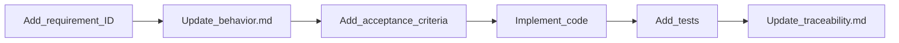

# Agent Workflow — Spec-Driven Development

Operating instructions for AI agents and contributors implementing changes in this repository.

## 1. Before coding

Read documents in this order:

1. [spec.md](spec.md) — system purpose, scope, pipeline
2. [requirements.md](requirements.md) — find the requirement ID for your task
3. Relevant section of [behavior.md](behavior.md) — normative rules
4. [interfaces.md](interfaces.md) — if touching public API, CLI, or env vars

**Rule:** Spec overrides PRD for implementation truth. Use [PRD](../prd.md) for product context only.

## 2. Adding a feature

Follow this sequence:



1. Add or extend a requirement ID in `requirements.md`
2. Document normative behavior in `behavior.md`
3. Add Given/When/Then criteria in `acceptance-criteria.md`
4. Implement in the correct layer (`config/`, `core/`, `infrastructure/`, `services/`)
5. Add unit tests; add regression cases to `tests/regression/cases.json` for validation rules
6. Update `traceability.md` with new mappings

## 3. Changing validation rules

Validation logic changes require **all** of:

- `behavior.md` — update rules and error catalog
- `tests/regression/cases.json` — add or update normative cases
- `acceptance-criteria.md` — add or update AC entries
- `traceability.md` — update mappings

If adding a static value set, also update `STATIC_VALUESETS` in `core/codeset_validator.py` and document the key in `behavior.md §2.4`.

## 4. Forbidden without spec update

Do **not** implement these without updating the Spec first:

| Change | Required spec files |
|--------|---------------------|
| New static value set | `behavior.md`, `requirements.md`, regression cases |
| New public server preset | `interfaces.md`, `requirements.md`, `behavior.md` (if behavior differs) |
| API contract change (return shape, method signature) | `interfaces.md`, `requirements.md`, `acceptance-criteria.md` |
| New error message format | `behavior.md` error catalog |
| New environment variable | `interfaces.md` |

## 5. Verification commands

Run before marking work complete:

```bash
# Offline unit + regression (required)
pytest -m "not integration"

# Regression suite only
make test-regression

# Coverage gate (core/ and services/ ≥ 80%)
make test-cov

# Optional: live server integration
pytest -m integration
```

## 6. Layer boundaries

| Layer | May import from | Must not |
|-------|-----------------|----------|
| `core/` | stdlib only | HTTP, env, config |
| `infrastructure/` | `requests`, config helpers | validation rules |
| `services/` | `core/`, `infrastructure/`, `config/` | — |
| `config/` | stdlib, `public_servers` | validation rules |

## 7. Showcase narrative

This repository demonstrates **retroactive spec extraction**:

- v0.1.0 was built organically (notebook → package → tests → docs)
- The `docs/Spec/` folder formalizes what was built
- v0.2+ work should follow **Spec → Implementation → Tests**

When proposing changes, cite the requirement ID in commit messages and PR descriptions:

```
feat: add Observation.status value set (FR-06)

- behavior.md §2.4: document allowed values
- regression: observation_status_invalid case
```

## 8. Related documents

| Document | Use when |
|----------|----------|
| [PRD](../prd.md) | Understanding product scope and personas |
| [ADR 001](../adr/001-fhir-search-validator.md) | Architecture decisions and trade-offs |
| [configuration.md](../configuration.md) | Operator setup and troubleshooting |
| [development.md](../development.md) | Local dev environment |
| [api.md](../api.md) | Quick API lookup (Spec is authoritative) |