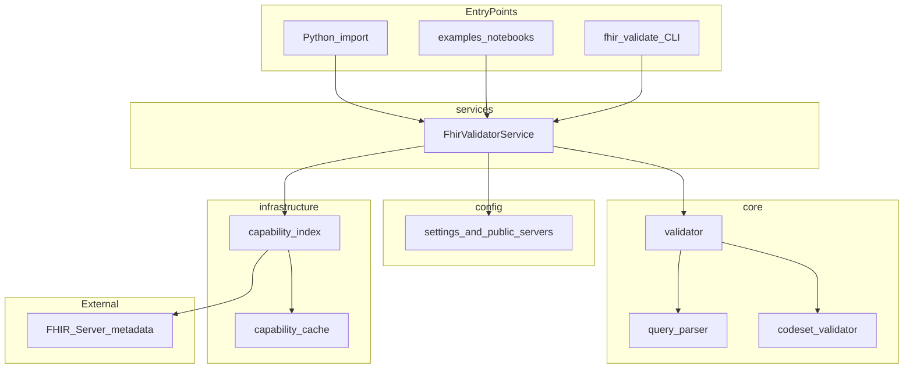
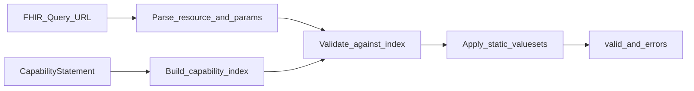

# System Specification — FHIR Search Validator

| Field | Value |
|-------|-------|
| **System** | FHIR Search Validator |
| **Version** | 0.1.0 |
| **Delivery date** | May 15, 2026 |
| **Status** | Baseline (retroactively derived from implementation) |
| **Spec type** | Implementation specification |

## 1. Purpose

The FHIR Search Validator is a **pre-flight utility** for FHIR REST search queries. Given a URL such as `Patient?gender=male`, it validates syntax and semantics against a target FHIR server's declared capabilities **before** the search request is executed.

It returns a deterministic result:

```python
{"valid": bool, "errors": list[str]}
```

## 2. Core principle

> Validate the query against what the server says it can do, not what the FHIR specification alone allows.

The server's **CapabilityStatement** (`GET /metadata`) is the primary authority for structural validation. A narrow static value-set layer supplements semantic checks where the CapabilityStatement does not enumerate coded values.

## 3. Scope

### In scope (v0.1.0)

- Parse FHIR search URLs into resource type and parameters
- Fetch and index CapabilityStatement metadata (with in-memory TTL cache and trigger-based invalidation)
- Validate resource types, search params, modifiers, and comparators
- Apply static value sets and Patient identifier rules
- Python library (`FhirValidatorService`) and CLI (`fhir-validate`)
- Four public no-auth test server presets
- Optional OAuth client-credentials for protected metadata
- Unit, regression, and integration test suites

### Out of scope

See [requirements.md — Out of Scope](requirements.md#out-of-scope-will-not). Summary: no query execution, no HTTP API, no GenAI, no terminology server lookups, no chained search validation.

## 4. System context



## 5. Validation pipeline



| Step | Component | Spec reference |
|------|-----------|----------------|
| Parse URL | `core/query_parser.py` | [behavior.md §2.1](behavior.md#21-url-parsing) |
| Fetch metadata | `infrastructure/capability_index.py`, `infrastructure/capability_cache.py` | [behavior.md §2.2](behavior.md#22-capabilitystatement-indexing) |
| Structural validation | `core/validator.py` | [behavior.md §2.3](behavior.md#23-structural-validation) |
| Semantic validation | `core/codeset_validator.py` | [behavior.md §2.4](behavior.md#24-semantic-validation) |
| Orchestration | `services/validator_service.py` | [interfaces.md](interfaces.md) |

## 6. Component responsibilities

| Layer | Path | Responsibility |
|-------|------|----------------|
| Config | `src/fhir_validator_agent/config/` | Environment loading, public server registry |
| Core | `src/fhir_validator_agent/core/` | Parsing, validation rules (no HTTP) |
| Infrastructure | `src/fhir_validator_agent/infrastructure/` | CapabilityStatement fetch, cache, OAuth |
| Services | `src/fhir_validator_agent/services/` | `FhirValidatorService` orchestration |
| CLI | `src/fhir_validator_agent/cli.py` | `fhir-validate` entry point |

## 7. Entry points

| Entry point | Command / import | Spec |
|-------------|------------------|------|
| CLI | `fhir-validate "<url>"` | [interfaces.md §CLI](interfaces.md#cli) |
| Python API | `FhirValidatorService.from_env().validate_query(url)` | [interfaces.md §Service](interfaces.md#fhirvalidatorservice) |
| Script wrapper | `python3 scripts/run_validator.py "<url>"` | Same as CLI |
| Demo notebook | `examples/notebooks/FHIR_search_validator_demo.ipynb` | FR-13 |
| Multi-server test | `python3 scripts/run_all_tests.py` | Integration |

## 8. Related documents

### Specification (this folder)

- [requirements.md](requirements.md) — requirement IDs
- [interfaces.md](interfaces.md) — contracts
- [behavior.md](behavior.md) — normative rules
- [acceptance-criteria.md](acceptance-criteria.md) — Given/When/Then
- [traceability.md](traceability.md) — requirement → code → test
- [agent-workflow.md](agent-workflow.md) — agent instructions

### Product and architecture

- [PRD](../prd.md) — product requirements
- [ADR 001](../adr/001-fhir-search-validator.md) — architecture decisions