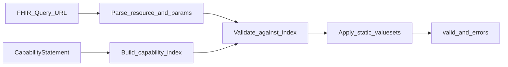

# Product Requirements Document: FHIR Search Validator

| Field | Value |
|-------|-------|
| **Product** | FHIR Search Validator |
| **Version** | 0.1.0 |
| **Status** | Active |
| **Last updated** | 2026-06-20 |

## 1. Problem Statement

Healthcare applications, data pipelines, and research workflows increasingly query FHIR servers using REST search URLs (e.g. `GET /Patient?gender=male&birthdate=gt2000-01-01`). In practice, query failures are common and expensive:

- **Server heterogeneity** — Each FHIR server supports a different subset of resource types, search parameters, modifiers (`:exact`, `:missing`), and comparators (`:gt`, `:lt`). A query that works on HAPI may fail on Firely or a private EHR endpoint.
- **Late failure** — Invalid queries are often discovered only at runtime, after network round-trips, retries, and logging overhead. Downstream jobs fail opaquely with HTTP 400 responses or empty result sets.
- **Weak pre-flight checks** — URL syntax validation alone is insufficient. A syntactically valid query can still reference unsupported parameters or invalid coded values.
- **Notebook-to-production gap** — Validation logic that proves useful in exploratory notebooks is hard to reuse in CI pipelines, CLIs, or backend services without a structured package and clear contracts.

### Who is affected

| Persona | Pain |
|---------|------|
| Data engineer | FHIR ETL jobs fail mid-pipeline due to unsupported search params |
| Backend developer | Must hardcode server-specific query rules or handle errors reactively |
| Clinical informaticist | Exploratory queries in notebooks do not translate to reliable automation |
| QA / integration tester | No fast way to assert query validity before hitting live servers |

### Success criteria

A developer can pass a FHIR search URL to the validator and receive a deterministic `valid` / `errors` result **before** executing the search, with rules derived from the target server's own CapabilityStatement plus a small set of domain-specific value-set checks.

---

## 2. Approach: Intelligent Use of the CapabilityStatement

Rather than maintaining a static catalogue of FHIR search rules, the validator treats each server's **CapabilityStatement** (`GET /metadata`) as the authoritative source of what that server claims to support.

### 2.1 Core principle

> Validate the query against what the server says it can do, not what the FHIR specification alone allows.

This makes validation **server-aware** and **self-updating**: when a server's capabilities change, re-fetching metadata refreshes the rule set without code changes.

### 2.2 Validation pipeline

| Step | Input | Output | Intelligence |
|------|-------|--------|--------------|
| **Parse** | Full or relative FHIR search URL | Resource type, param names, values | Extracts modifiers/comparators embedded in param names (e.g. `birthdate:gt`) |
| **Index** | CapabilityStatement JSON | Allowed resource types; per-resource search params with modifiers and comparators | Reads `rest[].resource[].searchParam[]` and FHIR-defined extensions for modifiers/comparators |
| **Validate (structural)** | Parsed query + index | Structural errors | Rejects unsupported resource types, unknown params, disallowed modifiers/comparators |
| **Validate (semantic)** | Param values + static rules | Semantic errors | Checks known coded value sets and domain-specific identifier rules |

### 2.3 What the CapabilityStatement enables

The CapabilityStatement is used to answer:

1. **Is this resource type searchable on this server?** — Derived from `rest[].resource[].type`.
2. **Is this search parameter supported for that resource?** — Derived from `rest[].resource[].searchParam[].name`.
3. **Are modifiers like `:exact` or `:text` allowed?** — Derived from `CapabilityStatementSearchParameterModifiers` extensions.
4. **Are comparators like `:gt` or `:le` allowed?** — Derived from `CapabilityStatementSearchParameterComparators` extensions.

### 2.4 Supplemental static rules

The CapabilityStatement does not enumerate all valid coded values for every parameter. The validator therefore applies a **small, explicit static value-set layer** for high-risk parameters where invalid values cause silent bad results:

- `Patient.gender`
- `AllergyIntolerance.verification-status`
- `AllergyIntolerance.clinical-status`
- `Patient.identifier` format rules (project-specific constraint)

Static rules are intentionally narrow. Structural correctness is delegated to the CapabilityStatement; semantic correctness is augmented only where the team has defined explicit business rules.

### 2.5 Design properties

| Property | Description |
|----------|-------------|
| **Server-first** | Rules are derived per server from live metadata |
| **Fail-fast** | Returns structured errors before any search request |
| **Layered** | Config, core logic, infrastructure, and orchestration are separated |
| **Embeddable** | Usable as a Python library, CLI (`fhir-validate`), or demo notebook |
| **Testable** | Unit tests use fixture CapabilityStatements; integration tests optionally hit live servers |

---

## 3. In Scope

### 3.1 Functional requirements

| ID | Requirement | Priority |
|----|-------------|----------|
| FR-01 | Parse a FHIR search URL into resource type and query parameters | P0 |
| FR-02 | Fetch and parse a server's CapabilityStatement from `/metadata` | P0 |
| FR-03 | Validate resource type against server-declared supported types | P0 |
| FR-04 | Validate search parameters against server-declared params per resource | P0 |
| FR-05 | Validate modifiers and comparators from CapabilityStatement extensions | P0 |
| FR-06 | Validate static coded value sets for defined resource.param pairs | P0 |
| FR-07 | Validate `Patient.identifier` against project-specific format rules | P1 |
| FR-08 | Return `{valid: bool, errors: list[str]}` result contract | P0 |
| FR-09 | Support HAPI R4 and Firely public servers via configuration | P0 |
| FR-10 | Support custom servers via `FHIR_METADATA_URL` / `FHIR_SERVER_BASE` | P0 |
| FR-11 | Optional OAuth client-credentials for protected metadata endpoints | P1 |
| FR-12 | CLI entry point (`fhir-validate`) and Python API (`FhirValidatorService`) | P0 |
| FR-13 | Demo notebook with positive and negative test scenarios | P1 |
| FR-14 | Unit tests with offline CapabilityStatement fixtures | P0 |

### 3.2 Non-functional requirements

| ID | Requirement |
|----|-------------|
| NFR-01 | Python 3.11+ |
| NFR-02 | No secrets committed; environment config via `config/.env.local` |
| NFR-03 | Unit tests run without network access |
| NFR-04 | Backward-compatible `FhirValidatorAgent` alias |

### 3.3 Deliverables (current release)

- Layered Python package under `src/fhir_validator_agent/`
- Configuration template at `config/.env.example`
- CLI and script wrappers under `scripts/`
- Unit and integration test suite under `tests/`
- Demo notebook at `examples/notebooks/`
- Documentation: README, PRD, ADR

---

## 4. Out of Scope

The following are explicitly **not** part of this product at v0.1.0. They may be considered in future releases.

### 4.1 Execution and retrieval

| Item | Rationale |
|------|-----------|
| Executing the search against the FHIR server | Validator is pre-flight only; it does not return resources |
| Pagination, `_include`, `_revinclude`, chained searches | Not validated in current release |
| `_sort`, `_count`, `_summary`, `_elements` | Special query modifiers not in scope |
| Bundle processing or result interpretation | No response handling |

### 4.2 API and agent frameworks

| Item | Rationale |
|------|-----------|
| HTTP/REST API service (e.g. FastAPI) | Library + CLI only for v0.1.0 |
| Google ADK / GenAI agent orchestration | Deferred; no LLM-driven query generation |
| Natural-language-to-FHIR-query translation | Separate product concern |

### 4.3 Dynamic terminology services

| Item | Rationale |
|------|-----------|
| Live ValueSet / CodeSystem lookups via Terminology Server | Static value sets used instead for defined params |
| SNOMED, LOINC, or ICD validation at query time | Requires terminology infrastructure not in scope |

### 4.4 Full FHIR conformance

| Item | Rationale |
|------|-----------|
| Complete FHIR R4 search specification enforcement | Server CapabilityStatement is the authority, not the full spec |
| FHIRPath or GraphQL query validation | Different query paradigms |
| Write operations (POST, PUT, PATCH) | Search validation only |
| SMART on FHIR scope validation | Auth scopes not validated |

### 4.5 Operations and platform

| Item | Rationale |
|------|-----------|
| CapabilityStatement caching or TTL policies | Metadata fetched on service init; no cache layer yet |
| Multi-tenant deployment / hosted SaaS | Consumer library, not a managed service |
| UI or dashboard | CLI, library, and notebook only |

---

## 5. Future Considerations

Items discussed but not committed:

- HTTP API wrapper for microservice deployment
- CapabilityStatement caching with configurable refresh
- Expanded static or dynamic value-set validation via `$validate-code`
- Google ADK agent that proposes queries and runs them through this validator
- Support for `_filter` and advanced search features per server

See the [3-Week Implementation Plan](../planning/README.md) for the delivery schedule and near-term engineering backlog.

---

## 6. References

- [FHIR R4 — CapabilityStatement](https://hl7.org/fhir/R4/capabilitystatement.html)
- [FHIR R4 — Search](https://hl7.org/fhir/R4/search.html)
- [README](../README.md)
- [ADR 001: FHIR Search Validator Architecture](adr/001-fhir-search-validator.md)