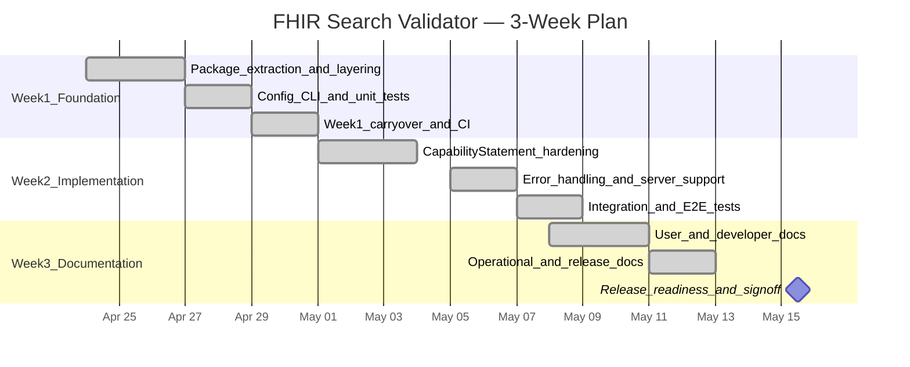

# 3-Week Implementation Plan

End-to-end delivery plan for the FHIR Search Validator — from foundation through hardened implementation to complete documentation and release readiness.

| Field | Value |
|-------|-------|
| **Duration** | 3 weeks |
| **Start date** | April 24, 2026 |
| **Delivery date** | **May 15, 2026** |
| **Target release** | v0.1.0 |
| **Scope reference** | [PRD](../docs/prd.md) |
| **Architecture reference** | [ADR 001](../docs/adr/001-fhir-search-validator.md) |
| **Last updated** | May 15, 2026 |

## Timeline

## Current status

| Week | Status | Completion |
|------|--------|------------|
| [Week 1 — Foundation](week-1-foundation.md) | Complete | ~95% |
| [Week 2 — Implementation](week-2-implementation.md) | Mostly complete | ~75% |
| [Week 3 — Documentation & Release](week-3-documentation-release.md) | In progress | ~85% |

### Delivered highlights

- Layered package, CLI (`fhir-validate`), 4 public no-auth servers
- 104 offline tests + 9 integration tests, 98% coverage on core/services
- Docs: PRD, ADR, **Spec (SDD)**, configuration, development, API, sample output, e2e checklist
- CI workflow (`.github/workflows/ci.yml`), LICENSE, CONTRIBUTING, CHANGELOG

### Remaining before v0.1.0 tag

- [x] Git tag `v0.1.0` pushed
- [ ] GitHub release published (create from tag on GitHub)
- [ ] First CI run on GitHub Actions
- [ ] Manual notebook E2E sign-off
- [ ] Week 2 hardening: structured errors, CapabilityStatement error handling (optional for v0.1.0)

## Weekly goals

| Week | Theme | Outcome |
|------|-------|---------|
| [Week 1](week-1-foundation.md) | Foundation | Layered package, CLI, config, unit tests, initial docs |
| [Week 2](week-2-implementation.md) | Implementation | Hardened validator, expanded tests, E2E coverage |
| [Week 3](week-3-documentation-release.md) | Documentation & release | Complete docs, runbooks, v0.1.0 sign-off |

## End-to-end success criteria

| # | Criterion | Status |
|---|-----------|--------|
| 1 | P0 PRD requirements (FR-01–FR-12, FR-14) | ✅ |
| 2 | Unit test coverage ≥ 80% on `core/` and `services/` | ✅ 98% |
| 3 | Integration tests pass (HAPI, Firely, Spark, WildFHIR) | ✅ |
| 4 | CLI and Python API documented with examples | ✅ |
| 5 | PRD, ADR, Spec (SDD), configuration guide, contributor docs | ✅ |
| 6 | No secrets in repository | ✅ |
| 7 | Demo notebook E2E on clean install | ⬜ manual |
| 8 | v0.1.0 tagged with changelog | ✅ tag pushed |

## Weekly plans

- **[Week 1 — Foundation](week-1-foundation.md)**
- **[Week 2 — Implementation](week-2-implementation.md)**
- **[Week 3 — Documentation & Release](week-3-documentation-release.md)**

## Out of scope

Per the [PRD](../docs/prd.md#4-out-of-scope): HTTP API, Google ADK/GenAI, terminology server lookups, persistent/distributed metadata cache, chained search / `_include` validation.