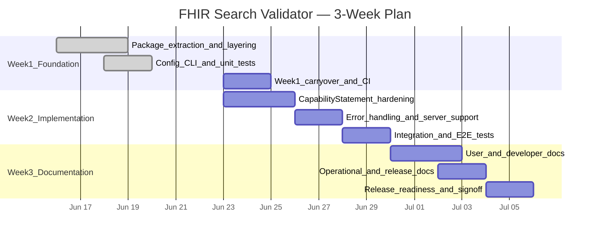
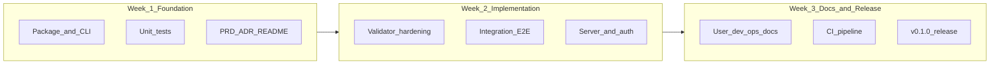

# 3-Week Implementation Plan

End-to-end delivery plan for the FHIR Search Validator — from foundation through hardened implementation to complete documentation and release readiness.

| Field | Value |
|-------|-------|
| **Duration** | 3 weeks |
| **Target release** | v0.1.0 |
| **Scope reference** | [PRD](../docs/prd.md) |
| **Architecture reference** | [ADR 001](../docs/adr/001-fhir-search-validator.md) |

## Timeline

## Weekly goals

| Week | Theme | Outcome |
|------|-------|---------|
| [Week 1](week-1-foundation.md) | Foundation | Layered package, CLI, config, unit tests, initial docs |
| [Week 2](week-2-implementation.md) | Implementation | Hardened validator, expanded tests, E2E coverage |
| [Week 3](week-3-documentation-release.md) | Documentation & release | Complete docs, runbooks, v0.1.0 sign-off |

## Current status (as of 2026-06-20)

Week 1 is **~80% complete**. The following are already delivered:

- Layered package (`config/`, `core/`, `infrastructure/`, `services/`)
- `FhirValidatorService` + `fhir-validate` CLI
- `config/.env.example` and gitignored secrets pattern
- 15 unit tests (offline)
- README with architecture diagram and Quick Start
- PRD and updated ADR

Remaining work spans Weeks 1–3 as detailed in the weekly plans below.

## End-to-end success criteria

By the end of Week 3, the project must satisfy:

| # | Criterion | Verification |
|---|-----------|--------------|
| 1 | All P0 PRD requirements (FR-01–FR-12, FR-14) implemented | PRD checklist review |
| 2 | Unit test coverage ≥ 80% on `core/` and `services/` | `pytest --cov` report |
| 3 | Integration tests pass against HAPI and Firely | `pytest -m integration` |
| 4 | CLI and Python API documented with working examples | README Quick Start |
| 5 | PRD, ADR, configuration guide, and contributor docs complete | Docs review |
| 6 | No secrets in repository; env template documented | Security checklist |
| 7 | Demo notebook runs end-to-end on a clean install | Manual E2E walkthrough |
| 8 | v0.1.0 tagged with changelog | Git tag + release notes |

## Workstreams

## Weekly plans

- **[Week 1 — Foundation](week-1-foundation.md)**
- **[Week 2 — Implementation](week-2-implementation.md)**
- **[Week 3 — Documentation & Release](week-3-documentation-release.md)**

## Out of scope for this 3-week plan

Per the [PRD](../docs/prd.md#4-out-of-scope), the following are **not** scheduled:

- HTTP/REST API service
- Google ADK / GenAI agent integration
- Live terminology server lookups
- CapabilityStatement caching layer
- Chained search, `_include`, pagination validation

These remain future considerations beyond v0.1.0.